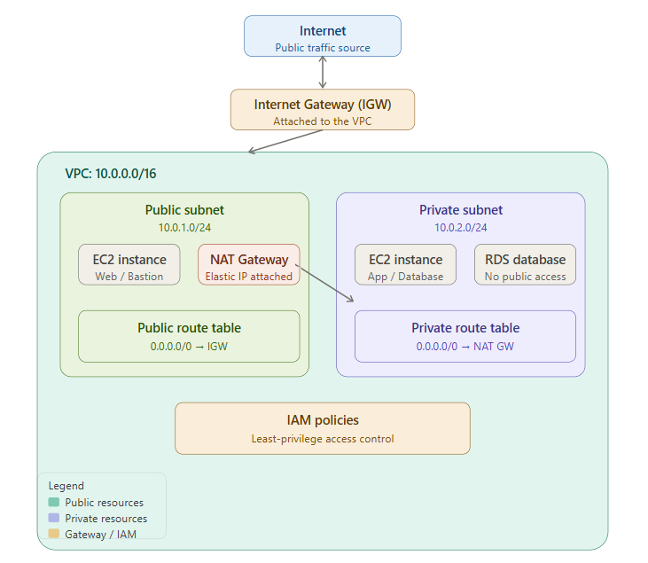
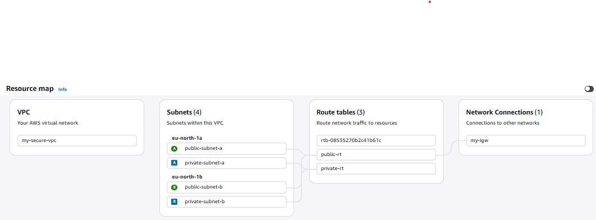

# AWS Secure VPC Setup
 
A custom-built VPC implementing a secure, multi-AZ network architecture with public/private subnet separation, following AWS best practices for production-style environments.
 
## Architecture Overview
 

 
The VPC follows a standard 2-tier, 2-AZ design used for highly-available web applications:
 
- **Public subnets** host internet-facing resources (e.g. load balancers, bastion hosts, NAT Gateway)
- **Private subnets** host application/database resources with no direct internet exposure
- Traffic flows are tightly controlled at both the subnet (route table) and instance (security group) level
## Resources Created
 
### VPC
 
| Setting | Value |
|---|---|
| Name | `my-secure-vpc` |
| CIDR block | `10.0.0.0/16` |
| Tenancy | Default |
| IPv6 | None |
 
### Subnets
 
| Name | AZ | CIDR | Type |
|---|---|---|---|
| `public-subnet-a` | ap-south-1a | `10.0.1.0/24` | Public |
| `public-subnet-b` | ap-south-1b | `10.0.2.0/24` | Public |
| `private-subnet-a` | ap-south-1a | `10.0.3.0/24` | Private |
| `private-subnet-b` | ap-south-1b | `10.0.4.0/24` | Private |
 
Public subnets have **auto-assign public IPv4** enabled. Private subnets do not.
 
### Internet Gateway
 
- `my-igw` — attached to `my-secure-vpc`, provides internet access for public subnets.
### NAT Gateway
 
- `my-nat-gw` — deployed in `public-subnet-a` with an Elastic IP, allows resources in private subnets to reach the internet (e.g. for OS updates, API calls) without being directly reachable from outside.
> **Cost note:** NAT Gateway is billed hourly + data processing charges. It is deleted when not actively in use to avoid unnecessary AWS charges during learning/practice.
 
### Route Tables
 
| Route Table | Associated Subnets | Routes |
|---|---|---|
| `public-rt` | public-subnet-a, public-subnet-b | `0.0.0.0/0` → Internet Gateway |
| `private-rt` | private-subnet-a, private-subnet-b | `0.0.0.0/0` → NAT Gateway |
 
### Security Groups
 
| Security Group | Inbound Rules | Purpose |
|---|---|---|
| `web-sg` | TCP 80 (HTTP) from `0.0.0.0/0`, TCP 443 (HTTPS) from `0.0.0.0/0` | Allows public web traffic to application servers |
| `db-sg` | TCP 3306 (MySQL) from `web-sg` only | Restricts database access to only the web tier — no direct internet or external access |
 
## Why I Chose This Setup
 
- **Multi-AZ design (2 AZs)**: Ensures the architecture can support high availability — if one AZ goes down, resources in the other AZ remain functional. This mirrors real production setups rather than a single-AZ "toy" VPC.
- **Public/private subnet separation**: Follows the principle of least exposure — only resources that genuinely need to be internet-facing (e.g. web servers, NAT Gateway) sit in public subnets. Databases and backend services stay isolated in private subnets.
- **NAT Gateway for private subnet egress**: Private resources can still pull updates/patches/dependencies from the internet without accepting any inbound connections — a standard security pattern.
- **Security group chaining (`web-sg` → `db-sg`)**: Instead of opening the database to an IP range, the DB security group references the web security group directly. This means only instances with `web-sg` attached can ever reach the database on port 3306, regardless of their IP — a much stronger and more maintainable access control than CIDR-based rules.
- **/24 subnets within a /16 VPC**: Provides room (251 usable IPs per subnet) for future scaling — additional EC2 instances, load balancers, or NAT instances — without re-architecting the network.
## Proof of Deployment
 
Screenshot from the AWS VPC Resource Map showing the actual deployed resources — VPC, 4 subnets across 2 AZs, route tables, and the attached Internet Gateway:

## Learning Notes

For an explanation of the core networking concepts (VPC, subnets, routing, NAT, security group chaining) behind this setup, see [CONCEPTS.md](./CONCEPTS.md)
 
## Next Steps
 
- Convert this setup to Infrastructure as Code using Terraform
- Deploy a sample web application across the public/private subnet architecture (Phase 3)
- Add VPC Flow Logs for network traffic monitoring (security audit project, Phase 4)
