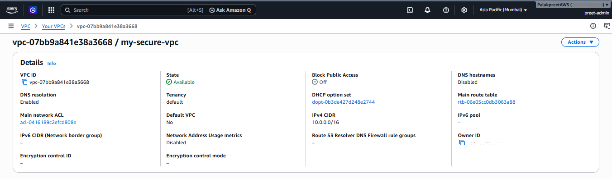
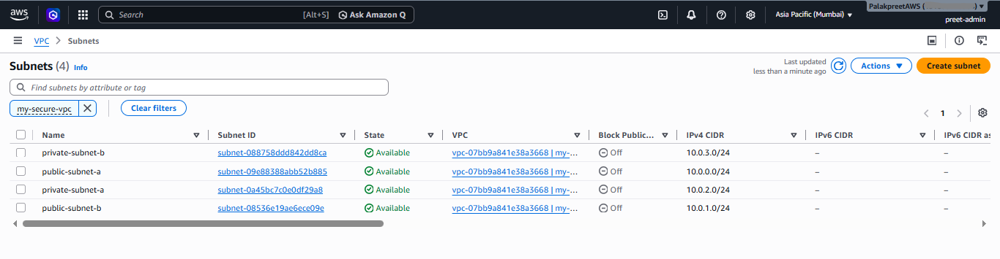
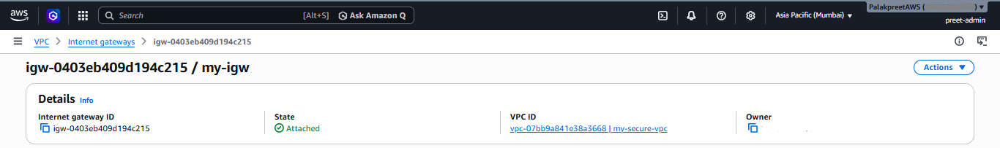
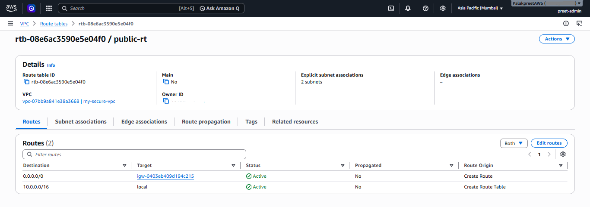
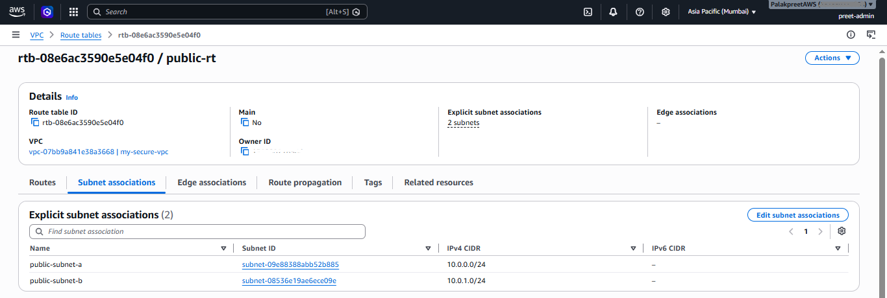
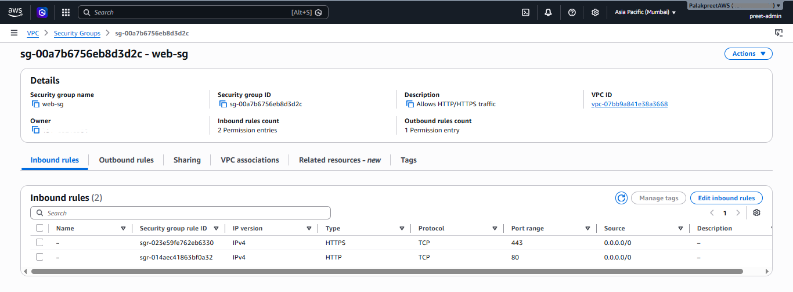
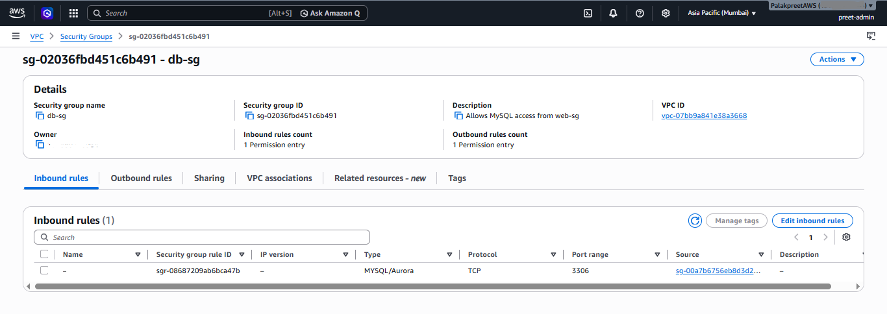
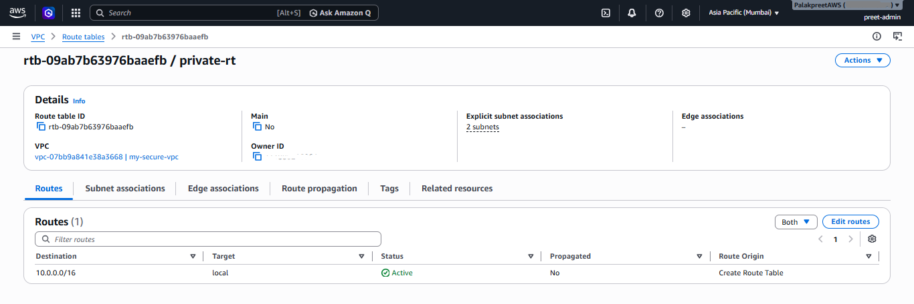

# Setup Verification — Phase 1 (VPC Foundation)

This document verifies that the core VPC infrastructure for `aws-vpc-secure-setup`
was created correctly, with screenshots taken directly from the AWS Console
(logged in as `preet-admin`, region: ap-south-1 / Mumbai).

## 1. VPC Created

**What this shows:** The core VPC `my-secure-vpc` with CIDR block `10.0.0.0/16`,
giving 65,536 available IP addresses to work with across all subnets.
State shows **Available**, confirming AWS finished provisioning it.
This is the network boundary everything else in this phase lives inside.

## 2. Subnets Created

**What this shows:** All 4 subnets, split into 2 public and 2 private,
spread across 2 Availability Zones (ap-south-1a and ap-south-1b) for
fault tolerance — if one AZ has an outage, resources in the other AZ
stay up. Each subnet has a distinct /24 CIDR carved out of the VPC's
/16 block:
- `public-subnet-a` — 10.0.0.0/24 (ap-south-1a)
- `public-subnet-b` — 10.0.1.0/24 (ap-south-1b)
- `private-subnet-a` — 10.0.2.0/24 (ap-south-1a)
- `private-subnet-b` — 10.0.3.0/24 (ap-south-1b)

## 3. Internet Gateway Attached

**What this shows:** `my-igw`, the component that lets resources in
public subnets reach the internet. State shows **Attached** to
`my-secure-vpc` — an IGW that exists but isn't attached does nothing,
so this confirms the attach step (Actions → Attach to VPC) was actually
completed, not just the IGW created.

## 4. Public Route Table — Routes

**What this shows:** `public-rt`'s route table with two active routes:
- `10.0.0.0/16 → local` (auto-created, lets resources talk to each other inside the VPC)
- `0.0.0.0/0 → my-igw` (the route that actually makes this table "public" —
  any traffic not headed inside the VPC gets sent to the internet gateway)

Both routes show **Active** status, confirming they're live, not just configured.

## 5. Public Route Table — Subnet Associations

**What this shows:** `public-rt` explicitly associated with `public-subnet-a`
and `public-subnet-b`. This step is what actually applies the internet
route to those two subnets — creating the route alone doesn't do anything
until it's linked to the subnets that should use it.

## 6. web-sg Inbound Rules

**What this shows:** `web-sg` allowing inbound HTTP (port 80) and HTTPS
(port 443) traffic from `0.0.0.0/0` (anywhere). This is the security
group meant for web-facing resources like an EC2 instance behind a load
balancer — open enough for public web traffic, restricted to only the
two ports a web server actually needs.

## 7. db-sg Inbound Rules

**What this shows:** `db-sg` allowing inbound MySQL traffic (port 3306)
with the source set to the `web-sg` security group ID (`sg-xxxx`), not
an IP range. This is security group chaining — instead of opening 3306
to a CIDR block, only resources that are themselves inside `web-sg` can
reach the database. Even if someone knows the DB's private IP, they
can't connect unless their traffic originates from a `web-sg` resource.

## 8. Private Route Table — No Internet Route

**What this shows:** `private-rt` with only the auto-created local route
(`10.0.0.0/16 → local`) — deliberately no `0.0.0.0/0` route yet. This is
expected at this stage: private subnets shouldn't have direct internet
access at all; they'll get outbound-only access via a NAT Gateway on
Day 2, which is a different mechanism from the public subnets' direct
IGW route.
