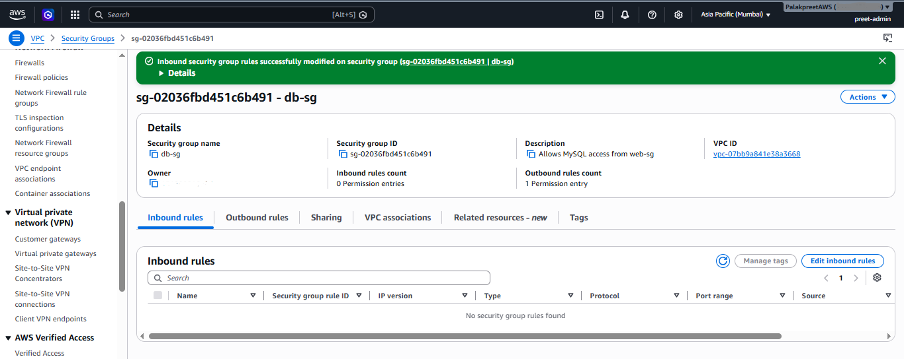
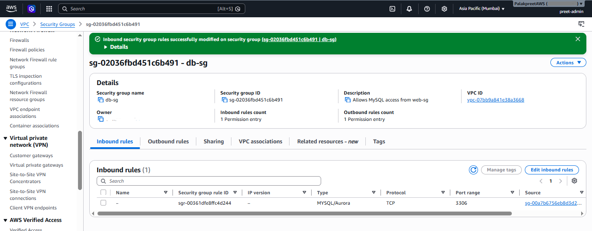

## Day 1 — VPC, Subnets, Routing, SG Chaining

### What I built
- VPC `my-secure-vpc` (10.0.0.0/16), 4 subnets across 2 AZs (ap-south-1a, ap-south-1b)
- Internet Gateway `my-igw`, attached to the VPC
- `public-rt` (routes to IGW) and `private-rt` (local only, NAT route added Day 2)
- `web-sg` (80/443 from 0.0.0.0/0) and `db-sg` (3306, source = web-sg via SG chaining)

### Experiment: breaking db-sg's inbound rule

**What I did:**
Deleted the only inbound rule on `db-sg` (MySQL/3306, source `web-sg`),
leaving the security group with 0 inbound permission entries.

**What I expected to happen:**
If an EC2 instance in `web-sg` tried to reach a database instance in
`db-sg` on port 3306, the connection would **hang and eventually time out**
— not get an instant "connection refused."

**Why this happens:**
Security groups are stateful *allow-lists*, not firewalls with explicit
deny rules. There's no "reject" rule to trigger an immediate response —
if no inbound rule matches the incoming traffic, the packet is silently
dropped at the network interface level. The client's TCP handshake never
gets a SYN-ACK back, so the client just waits until its own connection
timeout expires (typically 30s+, depending on the client). This is a key
difference from something like a Network ACL, which can have explicit
deny rules that reject traffic immediately.

**How I'd confirm this in a real scenario:**
Since there's no EC2 instance in this VPC yet, this is a structural/logic
test rather than a live traffic test. In a real deployment, I'd:
1. Check the SG inbound rules first — fastest way to catch this
2. Enable VPC Flow Logs (filtered to REJECT) to confirm the packet was
   actually dropped rather than some other issue (e.g. wrong port, SG
   not attached to the DB instance, NACL blocking it)

**Fix applied:**
Re-added the inbound rule: Type = MySQL/Aurora, Port = 3306,
Source = `web-sg` (security group reference, not a CIDR — this is what
makes it SG chaining rather than a plain IP allowlist).

**Takeaway:**
SG-to-SG references are safer than CIDR-based rules for internal traffic
like this, because access is tied to *group membership* rather than a
specific IP range. Even if the DB's private IP were somehow known/guessed,
traffic can't reach it unless it originates from something inside `web-sg`.
