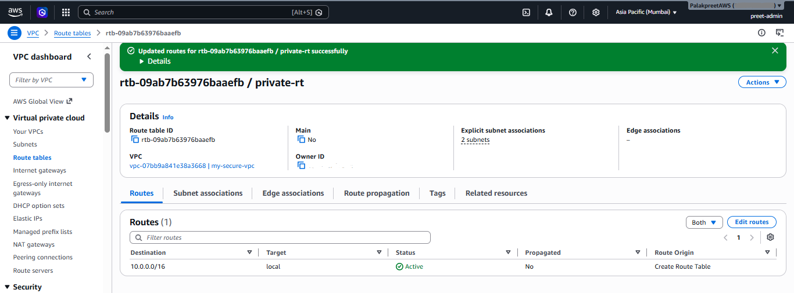
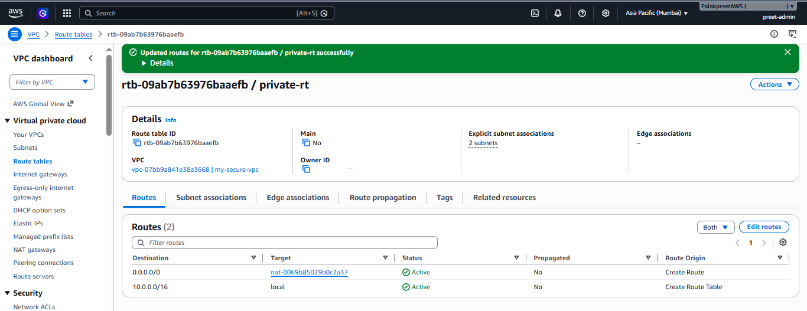
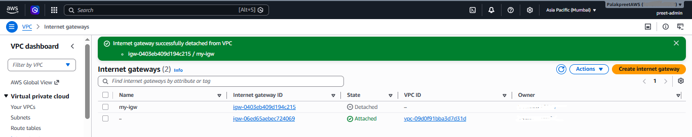
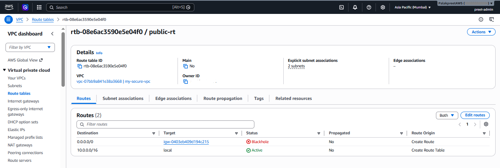
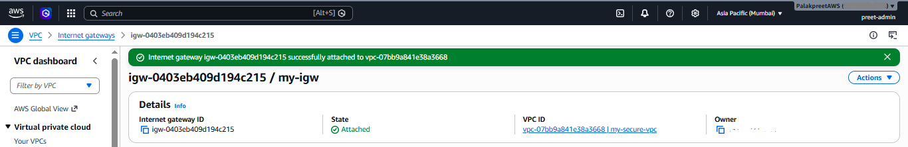
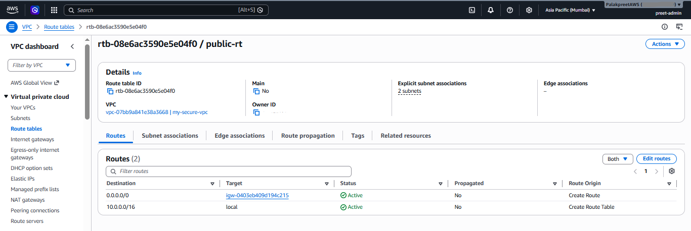
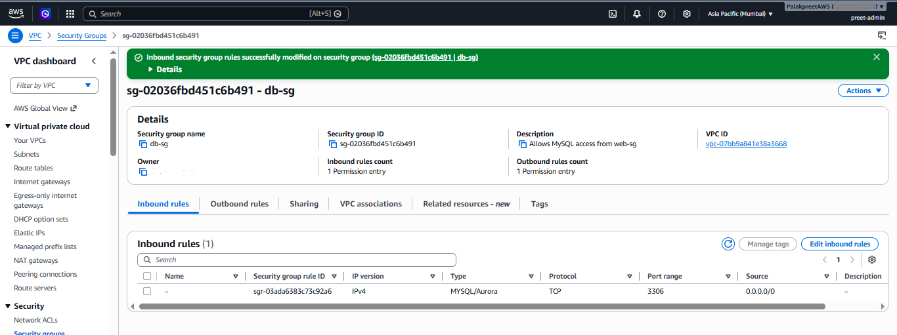
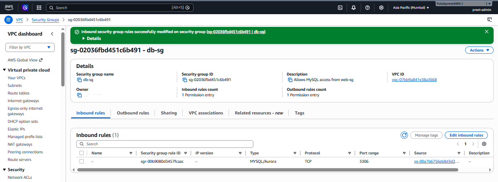

## Day 1 — VPC, Subnets, Routing, SG Chaining

### What I built
- VPC `my-secure-vpc` (10.0.0.0/16), 4 subnets across 2 AZs (ap-south-1a, ap-south-1b)
- Internet Gateway `my-igw`, attached to the VPC
- `public-rt` (routes to IGW) and `private-rt` (local only, NAT route added Day 2)
- `web-sg` (80/443 from 0.0.0.0/0) and `db-sg` (3306, source = web-sg via SG chaining)

### Experiment: breaking db-sg's inbound rule

**What I did:**
Deleted the only inbound rule on `db-sg` (MySQL/3306, source `web-sg`),
leaving the security group with 0 inbound permission entries.

**What I expected to happen:**
If an EC2 instance in `web-sg` tried to reach a database instance in
`db-sg` on port 3306, the connection would **hang and eventually time out**
— not get an instant "connection refused."

**Why this happens:**
Security groups are stateful *allow-lists*, not firewalls with explicit
deny rules. There's no "reject" rule to trigger an immediate response —
if no inbound rule matches the incoming traffic, the packet is silently
dropped at the network interface level. The client's TCP handshake never
gets a SYN-ACK back, so the client just waits until its own connection
timeout expires (typically 30s+, depending on the client). This is a key
difference from something like a Network ACL, which can have explicit
deny rules that reject traffic immediately.

**How I'd confirm this in a real scenario:**
Since there's no EC2 instance in this VPC yet, this is a structural/logic
test rather than a live traffic test. In a real deployment, I'd:
1. Check the SG inbound rules first — fastest way to catch this
2. Enable VPC Flow Logs (filtered to REJECT) to confirm the packet was
   actually dropped rather than some other issue (e.g. wrong port, SG
   not attached to the DB instance, NACL blocking it)

**Fix applied:**
Re-added the inbound rule: Type = MySQL/Aurora, Port = 3306,
Source = `web-sg` (security group reference, not a CIDR — this is what
makes it SG chaining rather than a plain IP allowlist).

**Takeaway:**
SG-to-SG references are safer than CIDR-based rules for internal traffic
like this, because access is tied to *group membership* rather than a
specific IP range. Even if the DB's private IP were somehow known/guessed,
traffic can't reach it unless it originates from something inside `web-sg`.

---

## Day 2 — NAT Gateway + Private Route Break

### What I built
- Elastic IP allocated for NAT Gateway use
- NAT Gateway `my-nat-gw` created in `public-subnet-a` (Zonal, Public connectivity)
- Added route to `private-rt`: `0.0.0.0/0 → my-nat-gw`

This gives private subnets outbound-only internet access — instances there
can reach out (e.g. package updates, calling external APIs) but nothing
from the internet can initiate a connection in, unlike the public subnets
which route directly through the IGW.

### Experiment: breaking the NAT route

**What I did:**
Deleted the `0.0.0.0/0 → my-nat-gw` route from `private-rt`, leaving only
the local route (`10.0.0.0/16 → local`).

**What I expected to happen:**
Any resource in a private subnet would lose all outbound internet access.
Intra-VPC traffic (talking to resources in other subnets within
`10.0.0.0/16`) would keep working fine, since the local route is untouched.

**Why this happens:**
Without a `0.0.0.0/0` route, there's simply no path out of the VPC for
private subnet traffic. It's not a case of AWS rejecting or blocking the
traffic at the edge — the traffic never leaves the VPC's local routing
scope at all, since the route table has no matching destination for it.
This is different from an SG block (Day 1), where traffic reaches the ENI
and gets dropped there — this failure happens earlier, at the routing layer.

**How I'd confirm this in a real scenario:**
An EC2 instance in a private subnet would show connection timeouts on any
outbound request (e.g. `curl`, `apt update`). Checking the route table
would be the fastest diagnostic step — no explicit error message points
to routing as the cause, so this is a "check the boring stuff first" case.

**Fix applied:**
Re-added the route: Destination = `0.0.0.0/0`, Target = `my-nat-gw`.

**Takeaway:**
Routing failures and security group failures look identical from the
outside (both present as timeouts), but the root cause and fix location
are completely different — one's a route table problem, the other's a
security group problem. Diagnosing correctly means checking both layers,
not assuming it's always the SG.

### Cleanup
Deleted `my-nat-gw` and released the associated Elastic IP at the end of
the session to avoid ongoing NAT Gateway hourly charges, since Day 3
doesn't require it. The `private-rt` NAT route was also removed since it
pointed to a now-deleted resource. Will recreate NAT Gateway when needed
again in Phase 3.

---

## Day 3 — IGW Detachment

### What I built
No new resources today — this exercise tests the existing `my-igw` and
`public-rt` setup from Day 1 by deliberately detaching the Internet Gateway.

### Experiment: detaching the Internet Gateway

**What I did:**
Detached `my-igw` from `my-secure-vpc` (VPC → Internet Gateways → Actions →
Detach from VPC).

**What happened to the route table:**
`public-rt`'s `0.0.0.0/0 → igw-0403eb409d194c215` route immediately changed
status from Active to **Blackhole**.

**What I expected / observed:**
- Both `public-subnet-a` and `public-subnet-b` would lose all internet
  connectivity — inbound and outbound — since the IGW is the single gateway
  handling both directions for public subnets.
- Intra-VPC traffic (the `10.0.0.0/16 → local` route) stayed **Active**
  and unaffected, since that route doesn't depend on the IGW at all.

**Why "Blackhole" specifically:**
This status is AWS's explicit signal that a route's target no longer
exists or is unreachable — in this case, the IGW is still defined as the
target in the route table, but since it's detached from the VPC, it can't
actually forward anything. This is a different failure mode from Day 2,
where the NAT route was missing entirely. Here the route is still
*configured*, just non-functional — which is exactly what "Blackhole"
is designed to flag, rather than making it look like a normal missing-route
problem.

**How I'd diagnose this in a real scenario:**
Checking the route table and specifically looking for "Blackhole" status is
the fastest diagnostic step — that status alone tells you the target
resource (IGW, NAT Gateway, peering connection, etc.) is gone or detached,
without needing to inspect the IGW/NAT Gateway itself first.

**Fix applied:**
Reattached `my-igw` to `my-secure-vpc` (Actions → Attach to VPC).

The `public-rt` route immediately returned to **Active** status — no manual
route table edit was needed, since the route definition itself never
changed, only the target's reachability.

**Takeaway:**
"Blackhole" is a distinct route status from a missing route (Day 2) or an
SG-level block (Day 1) — it specifically means the route exists but its
target is gone/unreachable. Recognizing this status immediately narrows
the diagnosis to "something attached to this target was detached or
deleted," rather than treating it as a generic connectivity issue.

---

## Day 4 — Dangerous SG Exposure + Final Cleanup

### What I built
No new resources today — this exercise tests `db-sg` from Day 1 by
deliberately over-permissioning it, the inverse of Day 1's "remove access"
exercise. This is the final troubleshooting day of the Phase 1 rebuild.

### Experiment: opening db-sg to the entire internet

**What I did:**
Attempted to change the existing 3306 rule's source from `web-sg` to
`0.0.0.0/0` directly. AWS blocked this:

> "You may not specify an IPv4 CIDR for an existing referenced group id rule."

This is a small but useful safety behavior — AWS won't let you silently
convert an SG-chained rule into an open CIDR rule with a single edit. It
forces an explicit delete-and-recreate, which adds one deliberate extra
step before an SG can be opened up this widely.

**Workaround used:**
Deleted the existing `web-sg`-sourced rule entirely, then added a new rule:
Type = MYSQL/Aurora, Source = Anywhere-IPv4 (`0.0.0.0/0`).

**What changes functionally:**
Nothing breaks. No error, no timeout, no visible symptom at all — this is
the dangerous part. The database now accepts MySQL connection attempts
from any IP on the internet, not just from resources inside `web-sg`.

**Why this is a real risk:**
Databases are common scanning/brute-force targets. Port 3306 open to
`0.0.0.0/0` means anyone running an internet-wide port scan (a constant,
automated occurrence, not a targeted attack) can attempt a connection. If
the DB has a weak password or an unpatched vulnerability, this becomes a
direct path to compromise — no need to breach the web tier first.

**Why SG chaining (source = web-sg) prevents this:**
Restricting the source to `web-sg` means inbound traffic must originate
from a resource that is itself inside that security group, regardless of
where the underlying request came from on the internet. An attacker has
to first compromise something inside `web-sg` before they can even attempt
to reach the DB — a real access barrier, not just an IP filter that's easy
to spoof or route around.

**How I'd catch this in an audit:**
Manually reviewing SG rules for any database port (3306, 5432, 1433, etc.)
with source `0.0.0.0/0` is a standard first-pass security audit check.
This is exactly the class of misconfiguration my `cloud-security-audit-tool`
project (P5) is designed to detect automatically, rather than relying on
someone remembering to check manually.

**Fix applied:**
Deleted the `0.0.0.0/0` rule, re-added the rule with source = `web-sg`.

**Takeaway:**
This exercise was different from Days 1–3 — those broke *availability*
(something stopped working, loudly). This one breaks *security* silently,
with zero functional symptom. That distinction is exactly why automated
config auditing matters: broken access is self-reporting, but broken
security often isn't, and has to be actively checked for.

---

### Final Phase 1 cleanup check
With all 4 days of the rebuild and troubleshooting complete, verified no
paid resources were left running:
- NAT Gateway: none active (deleted end of Day 2)
- Elastic IPs: none unassociated
- EC2 instances: none running

Remaining live resources are all free-tier structural components: VPC,
4 subnets, IGW (attached), `public-rt`/`private-rt`, `web-sg`/`db-sg`.

**Phase 1 rebuild status: complete.**
